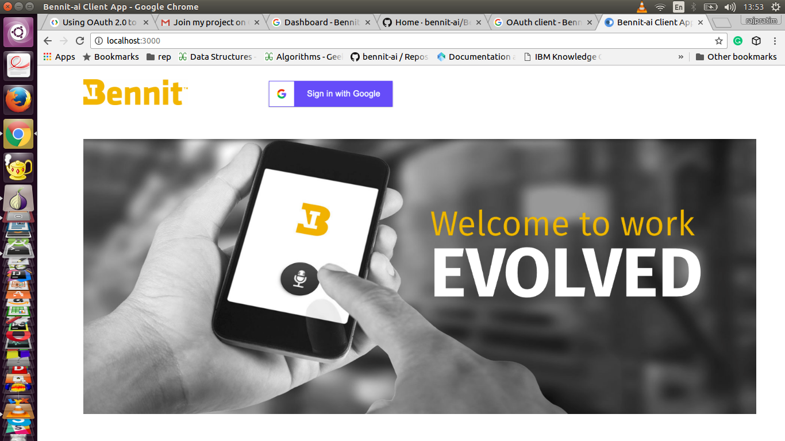
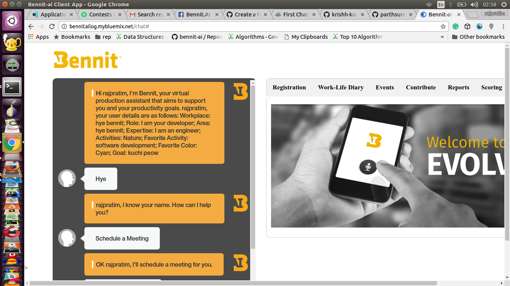
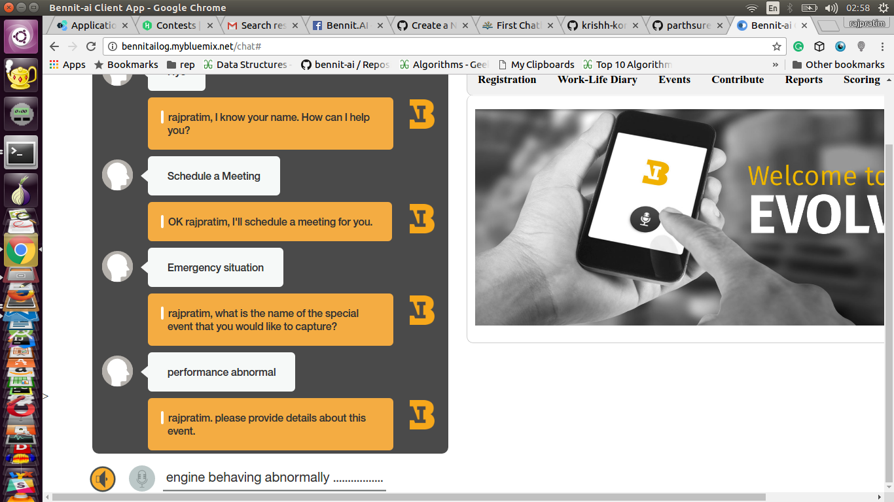
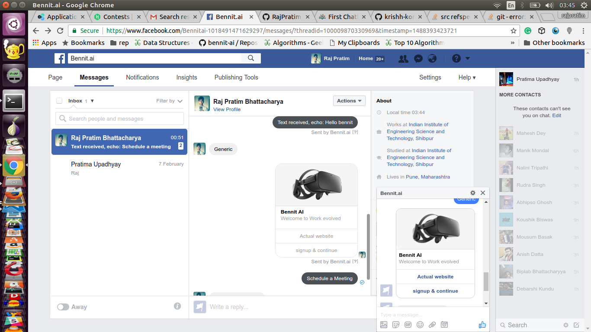

 # BennitAI_Server
This is a continuation of the BennitAI_backend_web. It aims to handle the new Early Access Program context. A new web UI will be developed here too.

this is the backend for the webapp as well as FB chatbot that is also currenly being extended to slack bot interface.

## Getting Started

### Creating a [IBM Bluemix][bluemix] Account

1. Go to https://bluemix.net/
2. Create a Bluemix account if required.
3. Log in with your IBM ID (the ID used to create your Bluemix account)


**Note:** The confirmation email from Bluemix mail take up to 1 hour.

### Deploy this sample application in Bluemix


#how to install

'npm install'

You will update the `.env` with the information you retrieved in steps 6 - 9.

    The `.env` file will look something like the following:

    ```none
    USE_WEBUI=true
    ALCHEMY_API_KEY=

    #CONVERSATION
    CONVERSATION_URL=https://gateway.watsonplatform.net/conversation/api
    CONVERSATION_USERNAME=
    CONVERSATION_PASSWORD=
    WORKSPACE_ID=

    #WEATHER
    WEATHER_URL=https://twcservice.mybluemix.net/api/weather
    WEATHER_USERNAME=
    WEATHER_PASSWORD=


    #CLOUDANT
    CLOUDANT_URL=

    #FACEBOOK
    USE_FACEBOOK=false
    FACEBOOK_ACCESS_TOKEN=
    FACEBOOK_VERIFY_TOKEN=

    #TWILIO
    USE_TWILIO=false
    USE_TWILIO_SMS=false
    TWILIO_ACCOUNT_SID=
    TWILIO_AUTH_TOKEN=
    TWILIO_API_KEY=
    TWILIO_API_SECRET=
    TWILIO_IPM_SERVICE_SID=
    TWILIO_NUMBER=
    ```


#prerequesities for running Facebook bot.
1. Make a Facebook app under Facebook developers.
2. Get a Page acess token
3. Take note of app secret and app id.
4. Enter them under auth/config.js and config/fbbot_cred.js
(this will take care of all the dependencies)
#how to run
'node server.js'

#known issues
1. make sure you are not behind a proxy otherwise Google auth with node js causes trouble.
2. Don't try to build this repo currently for the webapp , currently the webapp is supported 
    by production ready repo, this is just the Mirror of actual production service.

 
###Screenshots of Running Chatbot on Web app.

 

 

 

 ### Facebook chatbot demo with sliding window functunality..

  
